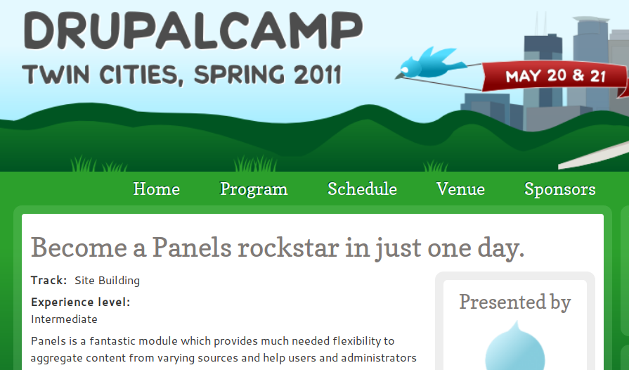
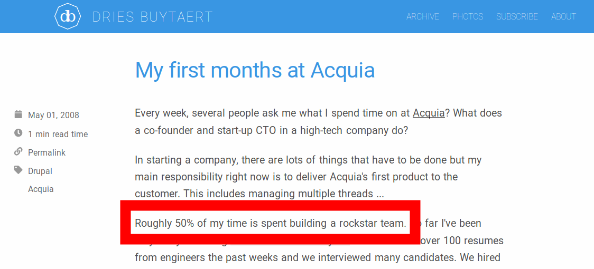
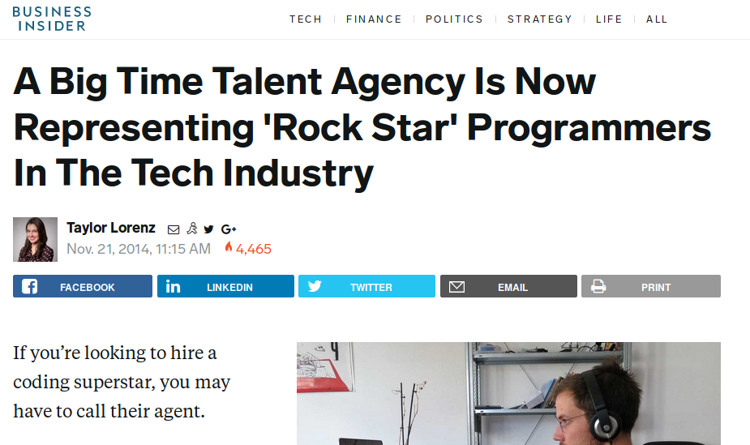
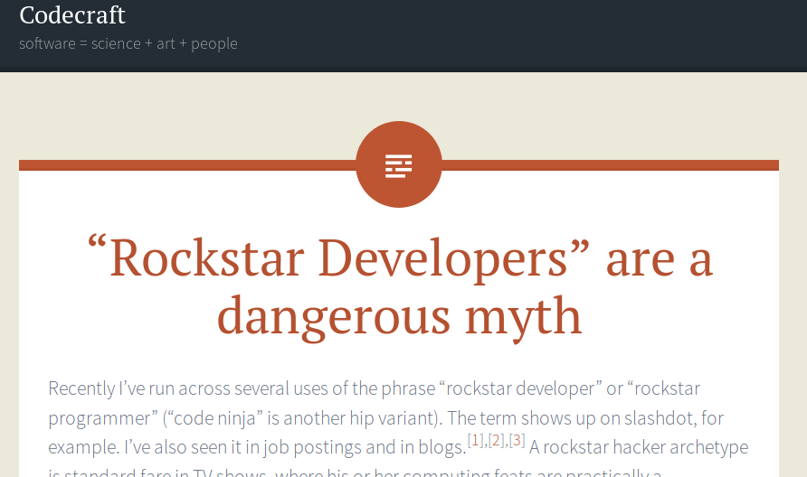
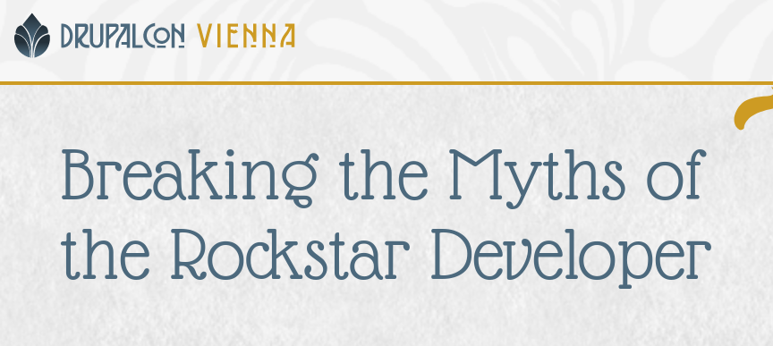
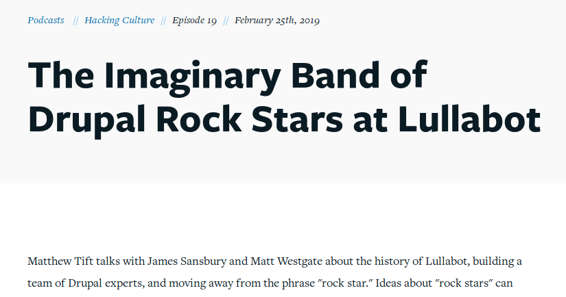
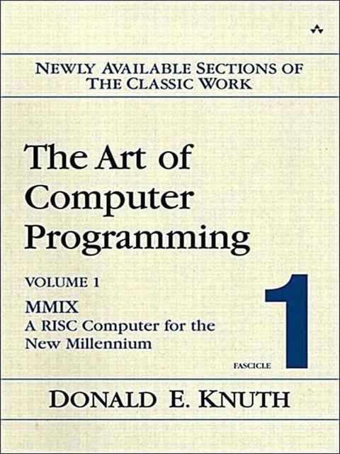
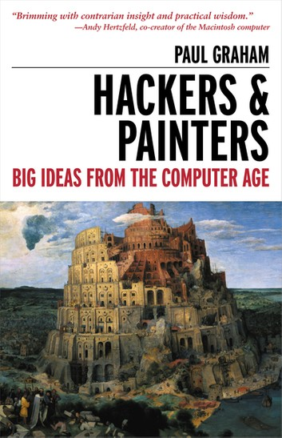
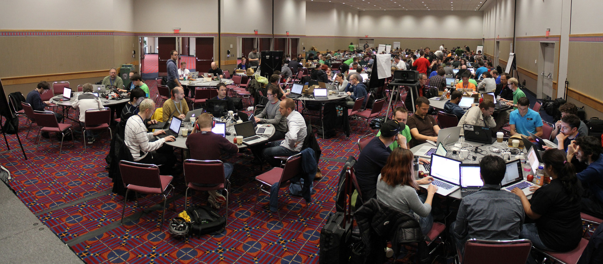
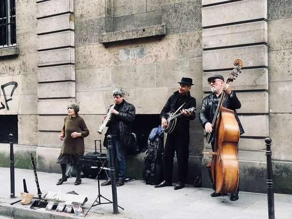

# Matthew Tift
* Senior Developer at [Lullabot](https://www.lullabot.com)
* Drupal core contributor since 2010
* Host of [Hacking Culture](https://www.lullabot.com/podcasts/hacking-culture)
* Musicologist

---

### Part of larger academic project

## 

<small>Image by [Gerd Altmann](https://pixabay.com/users/geralt-9301/?utm_source=link-attribution&amp;utm_medium=referral&amp;utm_campaign=image&amp;utm_content=3205452)</small>

# 
<small>Image by [Rocco Caruso](https://unsplash.com/photos/h4jXGhm8wuA)</small>

# Drupal Rock Star
* [Drupal.org](https://www.drupal.org/search/site/rockstar)
* [groups.drupal.org](https://groups.drupal.org/search/site/rockstar)
* Job postings
* Conversations

---

### [Earliest reference on drupal.org?](https://www.drupal.org/forum/general/news-and-announcements/2005-12-23/my-drupal-book-has-arrived)

# 
[DrupalCon Chicago 2011](https://chicago2011.drupal.org/sessions/so-you-want-be-drupal-rockstar.html)

# 
[DrupalCamps](http://2011.tcdrupal.org/node/117)

# 

# Certified to Rock

# 

# 
<small>[Jeff Robbins](https://www.flickr.com/photos/jjeff/8877750119/in/pool-lullabot/), [CC BY 2.0](https://creativecommons.org/licenses/by/2.0/)</small>

# The list goes on and on ...

# **Outline**
## 1. Background
## 2. Consequences
## 3. Reconceive

# **1. Background**

# 
*Billboard* 1960

# 
[Google Ngram](https://books.google.com/ngrams/graph?content=Rockstar&year_start=1900&year_end=2019&corpus=15&smoothing=3&share=&direct_url=t1%3B%2CRockstar%3B%2Cc0)

# 
[Job Titles](http://blog.indeed.com/2017/12/14/weird-job-titles-the-year-in-review/)

# 
*[The New York Times Magazine](https://www.nytimes.com/2015/08/16/magazine/how-rock-star-became-a-business-buzzword.html)*, 2015

# 

# [RockstarLang](https://github.com/RockstarLang/rockstar)
> "If we make Rockstar a real (and completely pointless) programming language, then recruiters and hiring managers won't be able to talk about 'rockstar developers' any more"

# How it's used
## 1. Compliment
## 2. Ideal

# Narrative

 
 
<small>Image by [Fathromi Ramdlon](https://pixabay.com/photos/once-upon-a-time-writer-author-719174/)</small>

---

## Narrative "ceaselessly substitutes meaning for the straightforward copy of the events recounted."
[Roland Barthes](https://en.wikipedia.org/wiki/Mythologies_(book)) (1915-1980)

---

## "Her name is in MAINTAINERS.txt"

## "She is a Drupal rock star"

---

## "The king died and then the queen died"

## "The king died and then the queen died **of grief**&nbsp;"

[E.M. Forster](https://archive.org/details/in.ernet.dli.2015.509170/page/n133) (1879-1970)

# "Translate *knowing* into *telling*&nbsp;"
[Hayden White](https://www.jstor.org/stable/1343174?seq=1#page_scan_tab_contents) (1928-2018)

# Genius

# 
<small>[pixabay](https://pixabay.com/vectors/mozart-man-person-artist-musician-161194)</small>

# Myth

# 
<small>[hackernoon.com/the-myth-of-a-rockstar-developer-e6564bd51b5c](https://hackernoon.com/the-myth-of-a-rockstar-developer-e6564bd51b5c)</small>

# 
<small>[codecraft.co/2015/03/04/rockstars](https://codecraft.co/2015/03/04/rockstars)</small>

# 
[Session title from DrupalCon Vienna 2017](https://events.drupal.org/vienna2017/sessions/breaking-myths-rockstar-developer)

# **2. Consequences**

---

## "Interpret each notion by tracing its respective practical consequences"
[William James](https://www.marxists.org/reference/subject/philosophy/works/us/james.htm) (1842-1910)

# Function

## What does the rock star concept *do*?

---

## Individuals
## Teams
## Imaginary Groups
## Communities

# 
<small>Photo by [Cytonn Photography](https://unsplash.com/photos/GJao3ZTX9gU)</small>

# 

# 
<small>[time.com/5312483/how-to-deal-with-impostor-syndrome](http://time.com/5312483/how-to-deal-with-impostor-syndrome)</small>

# "The anxiety of influence"
[Harold Bloom](https://en.wikipedia.org/wiki/The_Anxiety_of_Influence) (1973)

# Language that excludes manginalized groups

---

## "I want Lullabot to be known as leaders, not rockstars and ninjas."
[Matt Westgate](https://www.lullabot.com/about/matt-westgate), CEO, Lullabot (2019)

# 
[Hacking Culture Episode](https://www.lullabot.com/podcasts/hacking-culture/imaginary-band-drupal-rock-stars-lullabot)

# **3. Reconceive**

# 
[Drupal values and principles](https://www.drupal.org/about/values-and-principles)

# identity &#8594; action

---

## musical term &#8594; musical term
## (rock star) &nbsp; &nbsp; &nbsp; &nbsp; &nbsp; &nbsp; &nbsp; &nbsp; &nbsp; &nbsp; &nbsp; &nbsp; &nbsp; &nbsp; &nbsp; &nbsp;

# Hacking as *artististic espression*

# 

# 

# Hacker as *musician*?

# Rock Star as *performance*

---

## "Technologies can be understood as always already musical." 
[Roger Moseley](https://doi.org/10.1525/jams.2015.68.1.151) in *JAMS*, 2015

# 
[Virginal](https://metmuseum.org/art/collection/search/502325), ca. 1600

# 

# 
<small>[Aon fi](https://commons.wikimedia.org/w/index.php?curid=4511429) - [CC BY 3.0](https://creativecommons.org/licenses/by/3.0/)</small>

# **Perform at the keyboard**
(a learnable skill)

<!-- # -->
<!--<small>[D0ktorz](https://commons.wikimedia.org/w/index.php?curid=1228427) - [GPL](http://www.gnu.org/licenses/gpl.html)</small>-->

# **Arranging**

 
 
<small>[Dayne Topkin](https://unsplash.com/photos/cB10K2ugb-4)</small>

# **Borrowing**

 
 
<small>[Nietjuh](https://pixabay.com/photos/music-notes-music-melody-sound-3221097/)</small>

# 
<small>[Tim Bartel](https://www.flickr.com/photos/avatar-1/5499235063) - [CC BY-SA 2.0](https://creativecommons.org/licenses/by-sa/2.0/)</small>

---

## "To be original with the minimum of alteration is sometimes more distinguished than to be original with the maximum of alteration."
[T.S. Eliot](https://muse.jhu.edu/chapter/1690380) (1888-1965)

# #Social

 
 
<small>[Pedro Lozano](https://www.flickr.com/photos/peterlozano/8807308523)</small>

# Needs Review   **&#8595;**   RTBC

---

## Hackers learn to insert "usable software into a completely unfamiliar amalgamation of people, organizations, machines, and practices."
[Christopher Kelty](https://twobits.net) (2008)

# **Collaborate**

 
 
<small>[Josephine Bevan](https://unsplash.com/photos/MtRfjqCLJaU)</small>

# **Improvise**

 
<small>[mohamed_hassan](https://pixabay.com/vectors/jazz-silhouette-musician-trumpet-3662296/)</small>

---

## 1. Establish competency
## 2. Perform with a group

# Playful

---

## ~~Rock Star~~
## Arrange
## Borrow
## Collaborate
## Improvise

# Skillful improvising allows others to shine

# 
<small>[Ming Jun](https://unsplash.com/photos/-FC5Ozeetuw)</small>

<!-- ----->

<!-- ### Continually construct identities-->
<!---->
<!-- -->
<!-- -->
<!--<small>[christels](https://pixabay.com/photos/tower-fortress-castle-medieval-3584313/)</small>-->

# 
<small>[Alejandro Ortiz](https://unsplash.com/photos/oLPo2Rt4mzs)</small>

---

## Contribution opportunities
[Friday, April 12, 9:00 to 18:00](https://events.drupal.org/seattle2019/contribution)

 

 

## What did you think?
[http://seattle2019.drupal.org/schedule](http://seattle2019.drupal.org/schedule)  
[https://www.surveymonkey.com/r/DrupalConSeattle](https://www.surveymonkey.com/r/DrupalConSeattle)
